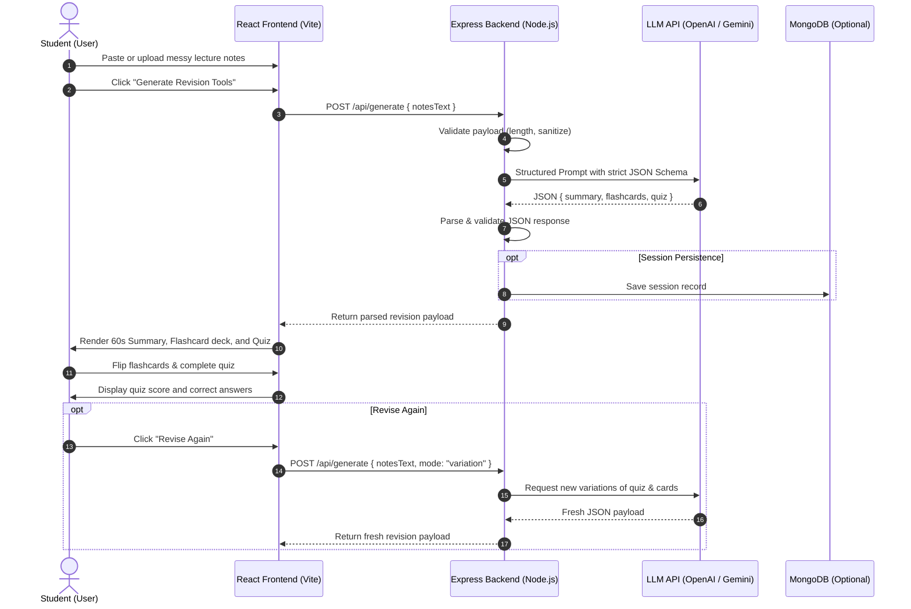

# Pocket Mentor
**Turn Messy Class Notes Into Revision Tools**  
**Team 07 | AU.28 Hackathon-01**

---

## 1. Project Title
**Pocket Mentor** — An AI-powered study companion that converts messy class notes into flashcards, an active-recall quiz, and a 60-second topic summary in one seamless step.

---

## 2. Problem Statement
Students consistently take notes during fast-paced college lectures. These notes are frequently:
- **Disorganized and shorthand-heavy**: Rapid typing or handwriting leads to fragments, missing grammar, and messy formatting.
- **Cognitively taxing to reorganize**: When exams approach, students spend the majority of their revision time merely cleaning up, formatting, or creating summaries and question cards rather than actually studying.
- **Prone to passive learning**: Many students rely on passive re-reading of their notes, which cognitive science has proven to produce the lowest retention rates.
- **Time-constrained**: Preparing flashcards and practice test questions manually requires hours that students do not have before deadlines.

This creates an inefficient study cycle where students waste precious hours preparing to study rather than mastering the material.

---

## 3. Proposed Solution / Approach
**Pocket Mentor** provides an end-to-end automated study tool that bridges the gap between raw notes and active revision.

1. **Effortless Input**: The student pastes or uploads raw lecture notes directly into the application without any requirement for pre-cleaning, punctuation, or formatting.
2. **Single Structured LLM Request**: The backend forwards the raw notes to a Large Language Model (e.g., OpenAI, Anthropic, or Gemini) equipped with a rigorous system prompt and strict JSON schema enforcement.
3. **Tripartite Revision Output**: In a single round-trip API call, Pocket Mentor generates:
   - **60-Second Plain-Language Summary**: High-level conceptual overview explaining the topic simply and concisely.
   - **Active Recall Flashcards**: Front/back question-and-answer pairs targeting fundamental definitions, theorems, and mechanisms.
   - **Self-Test Quiz**: Multiple-choice questions equipped with answer keys and distractor options to test conceptual understanding.
4. **Interactive Engagement**:
   - The student interacts with flashcards using a flip card interface.
   - The student takes the quiz with immediate feedback and receives an automated score breakdown.
5. **Dynamic "Revise Again" Loop**: If the student wants more practice, they can click "Revise Again" to prompt the LLM to generate an entirely new variation of questions and flashcards from the same underlying notes.

---

## 4. Key Features

| Feature | Description |
| :--- | :--- |
| **Raw Notes Ingestion** | Accepts direct text paste or plain text file uploads (`.txt`, `.md`). No pre-formatting needed. |
| **60-Second Topic Summary** | Clear, plain-language synthesis of core concepts designed to be read in under one minute. |
| **Automatic Flashcard Generation** | Generates 5–10 active-recall question-and-answer pairs extracted directly from lecture concepts. |
| **Automated Interactive Quiz** | Multiple-choice quiz with 3–5 questions featuring 4 distinct options and one verified correct answer. |
| **Instant Answer Checking & Scoring** | Local client-side instant validation highlighting correct/incorrect choices and displaying final percentage score. |
| **"Revise Again" Engine** | One-click regeneration loop providing fresh practice questions and cards from the same source notes. |
| **Session History (Stretch Goal)** | Persistent storage of past revision sessions via MongoDB, allowing students to track progress over time. |

---

## 5. Solution Workflow

### End-to-End Flow Diagram



### Detailed Flow Steps
1. **Input Phase**: The student accesses the `NotesInputScreen`, pastes raw notes or uploads a text file, and clicks **Generate**.
2. **Processing Phase**: The client makes a `POST /api/generate` request to the Express server with the notes payload.
3. **Inference Phase**: The server constructs a prompt that instructs the LLM to analyze the notes and output strictly valid JSON conforming to the contract.
4. **Rendering Phase**: The parsed JSON is sent back to the React client, transitioning the UI into the `ResultsScreen`.
5. **Testing & Evaluation**: The student reads the summary, flips through flashcards, and takes the multiple-choice quiz.
6. **Iteration Phase**: The student can either wrap up or hit **Revise Again** to generate new questions on the same concepts.

---

## 6. Technical Architecture (MERN + LLM)

### Architecture Stack

```
+-------------------------------------------------------------+
|                 Frontend: React.js + Vite                   |
|  - NotesInputScreen (Textarea, File Drop, Controls)         |
|  - ResultsScreen (Summary Viewer, Flip Cards, Quiz Engine)  |
|  - State Management: React useState / Context API           |
+-------------------------------------------------------------+
                              |
                     REST API (HTTP / JSON)
                              |
+-------------------------------------------------------------+
|                Backend: Node.js + Express                   |
|  - Routes: POST /api/generate, GET /api/health              |
|  - Middleware: CORS, JSON Parser, Rate Limiting             |
|  - Validation: Prompt Sanitization, JSON Schema Verification|
+-------------------------------------------------------------+
           |                                     |
           v                                     v
+-----------------------+              +----------------------+
|       LLM API         |              |   Database (Stretch) |
| - OpenAI / Anthropic  |              | - MongoDB Atlas      |
|   / Gemini API        |              | - Session history    |
| - JSON Structured Out |              |   & scores           |
+-----------------------+              +----------------------+
```

### Key Technical Specifications
- **Frontend (React + Vite)**:
  - Fast HMR and lightweight bundle size.
  - Interactive UI with flip animation for flashcards (`transform: rotateY(180deg)`).
  - Responsive quiz component with option selection, immediate radio feedback, and score calculation.
- **Backend (Node + Express)**:
  - Simple, robust microservice architecture.
  - Built-in error handling wrapping LLM communication in `try/catch` with automated fallback extraction if markdown fences (````json ... ````) are returned.
- **Prompt Engineering**:
  - Enforces single-turn generation minimizing API costs and latency.
  - Explicit instruction set preventing hallucinations outside the student's provided notes.

---

## 7. Real-World References & Competitive Analysis

| Competitor | Strengths | Limitations | Pocket Mentor Advantage |
| :--- | :--- | :--- | :--- |
| **Quizlet** | Global market leader in study sets; flashcard community; recent AI features. | Requires existing flashcard formats or multiple manual steps; cluttered with subscription tiers. | One-click transformation of raw notes directly into flashcards, quiz, and summary simultaneously. |
| **Anki** | Open-source, powerful spaced repetition algorithms (SM-2). | Steep learning curve; completely manual card creation; no built-in note summarization or automated quiz generator. | Zero learning curve; eliminates manual card drafting; converts shorthand notes instantly. |
| **Notion AI** | Excellent document summarization and drafting in-place. | Focused strictly on productivity/notes rather than active self-assessment; lacks flashcard deck interaction and quizzes. | Built explicitly for exam revision with active recall and self-testing features. |
| **Khanmigo** | Pedagogical AI tutor with guided questioning and conversational tutoring. | Tied specifically to Khan Academy's curated curriculum; cannot ingest a student's personal messy lecture notes. | Learns from the student's own unique classroom syllabus and professor's lecture emphasis. |

---

## 8. Team Member Details

**Team Number**: 07  
**Hackathon**: AU.28 Hackathon-01  

| S.No | Name | Roll Number | Branch | Core Responsibilities |
| :---: | :--- | :---: | :---: | :--- |
| 1 | **Sadhu Dwaraka Lokesh** | `24EG112B25` | IT | Full Stack Architecture & LLM API Integration |
| 2 | **Ganji Nithish** | `24EG105R62` | CSE | Frontend Components, UI/UX & Responsive Design |
| 3 | **Sri Vinya Reddy** | `24EG105P30` | CSE | Backend API Routes, Request Validation & Server Setup |
| 4 | **N. Sai Satya Nishika** | `24EG105B32` | CSE | LLM Prompt Design, JSON Verification & Test Cases |
| 5 | **Chalamalla Ruthwika** | `24EG105J07` | CSE | Quality Assurance, Error Handling & Documentation |

---

## 9. Future Roadmap & Enhancements
- **Audio Note Transcription**: Ingest voice memos and lecture recordings via Whisper API.
- **Handwritten Notes OCR**: Image upload of notebook pages with vision-based extraction.
- **Spaced Repetition Schedule**: Spaced reminder notifications for cards previously answered incorrectly.
- **PDF & Slide Deck Parsing**: Direct import of lecture slides (`.pptx`, `.pdf`).
